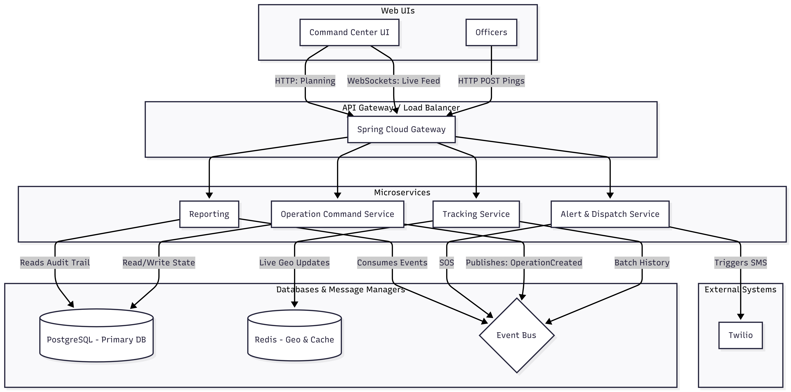
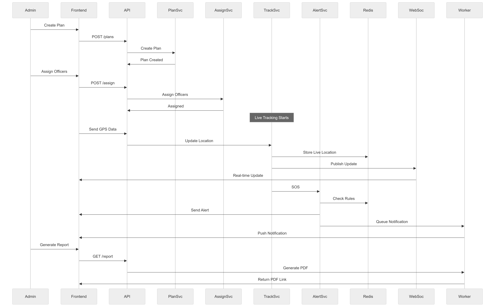
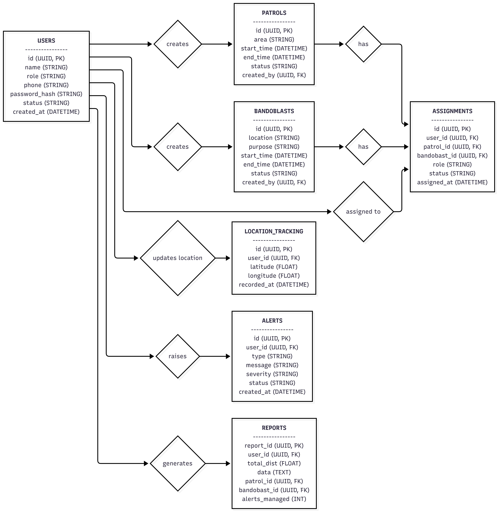
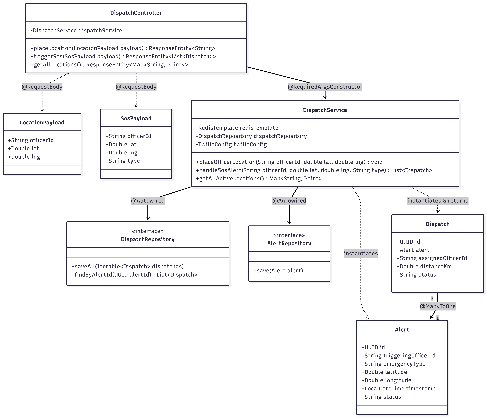

  <h1> CopMap: SOS  </h1>
  

    <b>A full featured SOS backend service.</b>
  

<!-- Tech Stack Badges -->
  

    
    
    
    
    
  

---

##  Problem Understanding

CopMap is a backend system designed to support two critical police operations: **Patrolling** and **Nakabandi/Bandobast**.  
It models these as real-world workflows involving planning, execution, monitoring, and reporting.
CopMap provides a structured backend to:
- Plan operations for specific objectives and timelines  
- Assign officers based on availability and skillset  
- Monitor live field activity  
- Enable communication and alerts(SOS)
- Maintain logs

##  Core Operations

###  Patrolling
- Systematic operation in particular areas to:
    - Prevent crime  
    - Provide public assistance

###  Nakabandi
- Roadblocks for vehicle checks  
- Search operations  
- Arresting Suspects 

###  Bandobast
- Security for events, festivals, protests  

---

##  Assignment of Officers
- Managed by **SHO**  
- Done during **Morning Roll Call**  
- Based on:
  - Crime trends  
  - Availability  
  - Skillset  

---

##  Roles & Responsibilities

| Role | Responsibility |
|------|----------------|
| SHO | Create & assign operations |
| Head Constable | Manage execution |
| Police Constables | Field work |
| DCP / SI | Monitoring |

---

##  System Architecture

The system utilizes a hybrid datastore approach. **Redis** handles the volatile, high-throughput ingestion of mobile GPS pings, while **PostgreSQL** acts as the complete record for shift planning and dispatch audit trails.

  

### 1. Interface
This is where the admin and police officer interact with the system.

*  **Police Officers:** Officers ping thier GPS coordinates every 5 seconds.
*  **Admin Workspace:** The dashboard for admin. It maintains a persistent, open connection to watch the city in real-time.
*  **API Gateway:** The front door.
   * *Responsibility:* It takes an incoming request (e.g., POST /api/v1/locations) and forward to the required microservice.

---

### 2. Microservices
The system is split into four microservices. Sepration of microservices helps us to manage the interactions even at high ping.

#### A. Operation Command Service
* Here we assign two entites:
  * Operation: OperationId, type, name, centerLat, centerLng, radiusMeters, status, startTime, endTime
  * Assignment: AssignmentId, operationId, officerId, role
* Reads or Writes to PostgreSQL. Publishes 'OperationCreated' or 'OperationClosed' events to Event Bus.

#### B. Tracking Service
It inputs coordinates as fast as possible.
* We use LocationPing entity: 
  * LocationPing: officerId, lat, lng, timestamp, batteryLevel, accuracy
* Here we nstantly updates Redis (GEOADD) and publishes a 'LocationUpdated' event to Event Bus.

#### C. Alert & Dispatch Service
It listens for alert and executes the dispatch algorithm.
* Alert and Dispatch entity helps to provide layout at alert system.
  * Alert:  id, triggeringOfficerId, type, originLat, originLng, timestamp, status
  * DispatchRecord: id, alertId, assignedOfficerId, distanceAtDispatchKm 
* Firstly alert is triggered by REST (SOS button)then Queries Redis (GEORADIUS) finds nearby units. System writes the final 'DispatchRecord' to PostgreSQ and calls external Twilio APIs providing SMS to nearby units.

#### D. Reporting
Generates PDFs and shift summaries.
* Shift summary entity manages layout of daily records.
  * ShiftSummary: officerId, date, totalDistanceKm, alertsRespondedTo
* Event bus merges all the summary records and writes the final report to the Postgres.

---

### 3. Database & Event Bus
This is where state is maintained and services communicate asynchronously.

*  **Redis:**
   It Holds the geospatial index (strictly mapping officerId to X,Y coordinates).
  Holds active state and keeps status up-to-date.
* **PostgreSQL:**
  * Its a relational DBMS. It enforces foreign keys (e.g., an Assignment cannot exist without a valid Operation). If the system loses power, PostgreSQL ensures no records are lost.
* **Event Bus:**
  * It bridges the gap between the operation command service, reporting service, alert system and tracking service.
 
---

## Sequence Workflow

Workflow depicts the interaction of various services and API calls.

  

---

The workflow starts when an admin creates a plan through the frontend, which is sent to the backend via the API and stored by the Plan Service. Once the plan is created, officers are assigned using the Assignment Service.

After deployment, officers in the field continuously send/pings their GPS location. This data is processed by the Tracking Service, stored in Redis for fast access, and pushed to the dashboard in real time using WebSockets.

If any critical event occurs, like an SOS trigger, the Tracking Service notifies the Alert Service. The Alert Service checks necessary conditions, sends alerts to the frontend, and also queues notifications for asynchronous processing.

Finally, when the operation ends, the admin can request a report. The backend generates a PDF asynchronously and returns a link to the frontend.

## Database

  

---

So basically, I designed this schema by thinking how real police operations would actually work instead of just making random tables.

First, we took the Users table. This stores all police personnel like SHO, constables, PSI etc. Each user has a role, because the whole system depends on each other and permissions.

Then there are two main operation tables: Patrols and Bandobast.

Both have fields like time, status, and who created them (SHO).

Now the most important table is Assignments.
This acts like a bridge between users and operations. I attached assignements to patrols and bandobasts as we assign officers, define their roles and track assignment status.

For real-time tracking, I added Location Tracking. Each entry stores latitude, longitude, and timestamp for a user. It usually helps in Monitoring patrol movement and ensuring officers are in assigned areas.

Then comes Alerts, this table handles emergency events like Suspicious activity, SOS, alerts, Incident reports.Each alert is linked to a user and has severity, status so the admin can act accordingly.

---

## Implementation of SOS alert System

In the above repository, I have implemented SOS alert system, considering the Spring Boot, APIs, Location (using Redis), and Twilio.

  

---
**Dispatch Controller:** It is an entry point of the frontend consisting three REST APIs (placeLocation, getLocations, triggerSos), it routes traffic and returns ResponseEntity objects.

**DTOs:** LocationPayload and SosPayload are java objects that accepts the Json data. These are used to prevent external users passing data into our database entries.

**Dispatch Service:** Most important bridge, coordinating Redis, Twilio and PostgreSQL database.

**JPA interfaces:** DispatchRespository and AlertRepository uses simple method to abstract the complex SQL quries.

**Domain Entities:** Alert represent the actually emergency event and Dispatch represents the assignment of officers to the alerts.

## Trade-offs

1. **Synchronous Processing**: While providing response to the alert, handleSosAlert returns the List of Dispatched officers. Here API request is waiting for database to save and Twilio to send SMS before responding to user. But Twilio API is slow, which results in User to hang up even though this Synchronus proccessing is immidate.

    So, we use Asynchrounous processing(@Async) to dispatch SMS.

2. **WebSockets:** WebSockets requires maintaining persistent, stateful connections on the server, which complicates scaling. REST APIs are stateless and much easier to build and test.

## Implemented
1. A clean architecture with separation between DTOs, Entities, Controllers and Services.
2. A Hybrid Data Stratergy used to leverage Redis for volatile data and PostgreSQL for immutable audit logs.
3. Simple frontend consisting Redis GeoMapping and Twilio SMS provider.

## Skipped

1.  **MySQL:**  Has spatial data types, but its geospatial indexing and function library are relatively basic. But PostgreSQL has PostGIS which is powerful open-source spatial database engine, which manages complex geometric operations seamlessly. 
2. **Live Monitoring:** To make the users move in real-time, we need WebSockets. This requires the server to keep a stateful, persistent TCP connection open for every single dispatcher watching the map. It will lead to complex monitoring section.

##  API Documentation

### 1. Place Officer Location
Updates the live location of an active officer in the Redis Geospace.
*   **Endpoint:** POST /api/v1/copmap/place-location
*   **Payload:**
    json
    {
      "officerId": "OFC-101",
      "lat": 18.5200,
      "lng": 73.8560
    }

You can add more officers by changing OfficerId, lat and lng with slight difference.

### 2. Trigger SOS Emergency
Executes the dispatch algorithm, finding all officers within 5km, and sending SOS sms alerts to the users.
*   **Endpoint:** POST /api/v1/alerts/sos
*   **Payload:**
    json
    {
      "officerId": "OFC-01",
      "lat": 18.5210,
      "lng": 73.8560,
      "type": "RIOT"
    }

### 3. Get All Active Locations
Retrieves the raw map of all officers currently online.
*   **Endpoint:** GET /api/v1/copmap/locations

---

## Spring Boot and Docker Run Instructions
To run the full stack locally (Postgres, Redis, and the Spring Boot App), follow these steps.

1. Clone the repository:

    git clone [https://github.com/nayanbuchade03/sos-service.git](https://github.com/nayanbuchade03/sos-service.git)

2. Start the Infrastructure:

    Ensure Docker Desktop is running.

    docker-compose up -d

3. Build and Run the Backend:

    ./mvnw clean install

    ./mvnw spring-boot:run

4. Resetting the Data:

    If you need to clear the active officers from the map during testing, run this command to flush the Redis cache:

    docker exec -it copmap-redis redis-cli FLUSHALL

5. Running frontend:

    cd path/to/your/sos-frontend

    npm install

    npm run dev

